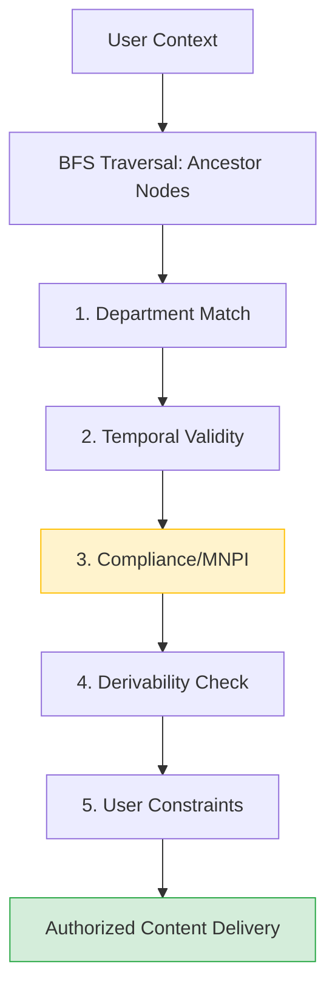

# Brahmo Clinical Pipeline

## Project Overview
Brahmo is a deterministic, rule-based clinical decision support pipeline. It provides a transparent, auditable interface for navigating complex clinical knowledge graphs while enforcing strict multi-stage compliance and access control policies.

## System Architecture
The pipeline utilizes a BFS-based graph traversal followed by a sequential 5-stage filter to ensure clinical safety and data isolation.

### Key Features

* Deterministic Logic: Guaranteed consistent outputs for clinical safety; zero reliance on non-deterministic LLMs.

* Pipeline Transparency: Real-time "Filter Funnel" visibility allows auditors to track node reduction at every stage.

* Context-Aware Comparison: Side-by-side dashboard views demonstrate deterministic data isolation based on user persona.

* O(V+E) Efficiency: Optimized graph traversal for high-performance clinical data retrieval.

### Workflow Summary

* Request Initiation: The frontend captures userId and entryNode, triggering the API.

* Graph Mapping: The backend executes a BFS to traverse the Directed Acyclic Graph (DAG) and establish the reachable node set.

* Sequential Refinement: The candidate set is processed through five distinct validation layers. Each layer prunes nodes that violate clinical or compliance policies.

* Content Retrieval: Final authorized nodes are used to fetch medical protocols and content.

* Dashboard Visualization: The frontend renders the "Filter Funnel" (audit trail) and "Knowledge Path" (DAG view) to provide total system visibility.

### Setup

* Clone the repository.

* Create a virtual environment and install dependencies:

# Bash
* pip install -r requirements.txt
* Create a .env file in the root directory:

# Plaintext
* SUPABASE_URL=your_url
* SUPABASE_KEY=your_key
# Run the API:

# Bash
* uvicorn main_api:app --reload
# Start the frontend:

# Bash
* cd brahmo-frontend
* npm start
### Documentation

* For a deep dive into the underlying graph theory and filtering logic, please refer to the architecture.md file.